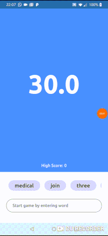

# Typer - Improve your Typing Speed.

This is my submission for the #FlutterCreate contest. My goal was to create a simple game to improve your typing speed.

<div style="text-align:center"></div>

I heard about #fluttercreate contest on April 4th and it took me only a day to build this app for a contest. I was really impressed how easy and fast you can build apps with Flutter.

## How to run

1. Clone it!

2. Connect your mobile device or use emulator.

3. run `flutter run --release`

## How to play

1. Focus text input and start typing.

2. Incorrect words marks input red.

3. Correct words gives you points of how many letters word has.

*Good luck! Try to beat your high score!*

## Side notes

Code is formatted using `dartfmt`

```
❯ find . -name "*.dart" | xargs cat | wc -c
    5089
```

License
-
The MIT License (MIT). Please see License File for more information.

[](https://github.com/Rhymond/flutter-create)
